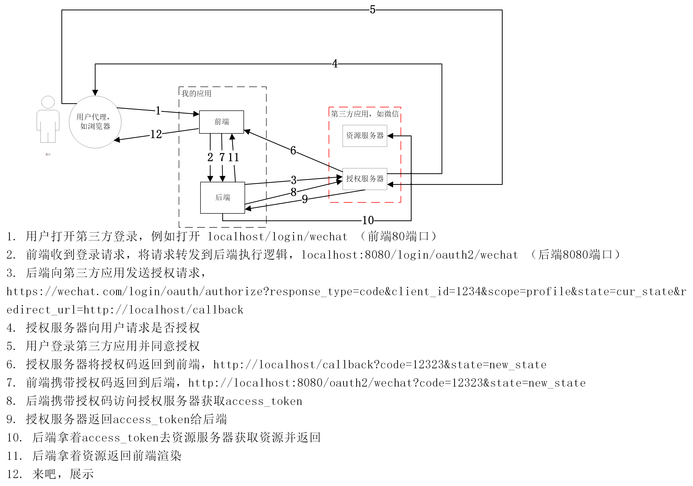
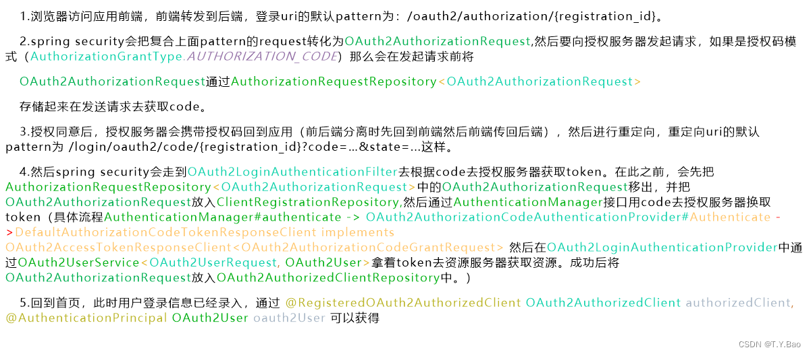
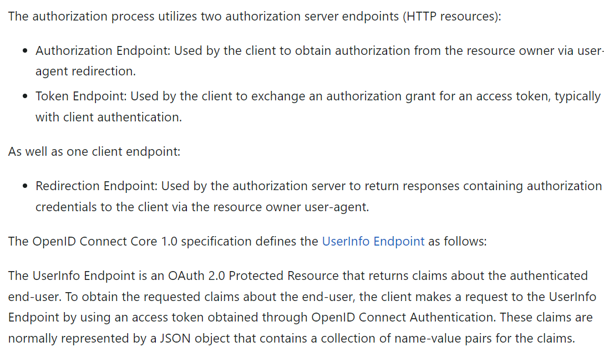
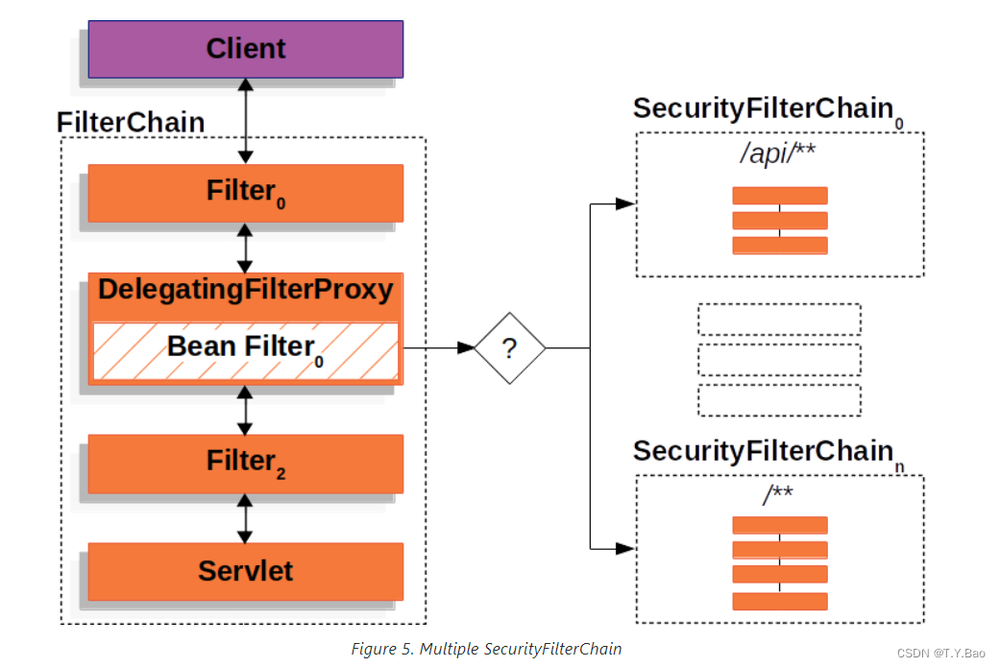
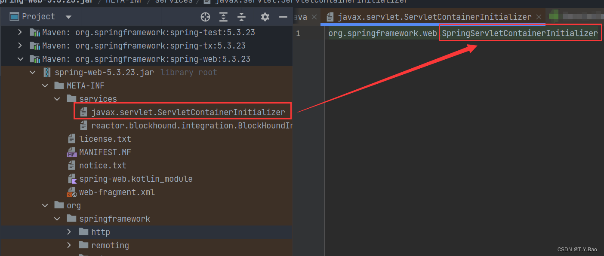
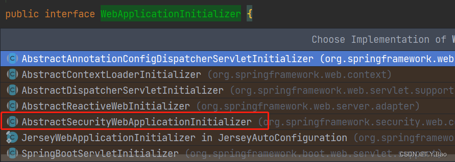
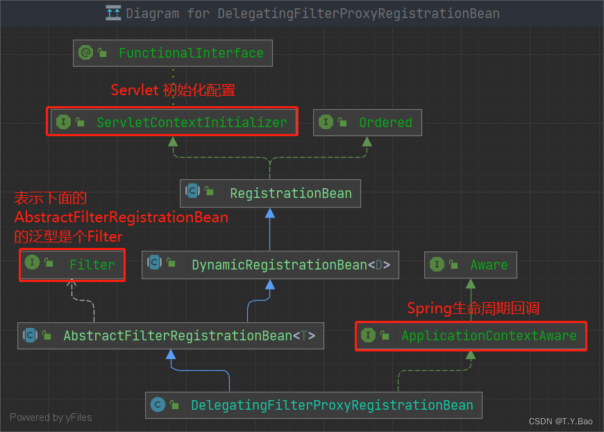

# 工程简介

Spring Security 前后端分离Oauth2.0




当要使用oauth2.0第三方登录时，uri默认的pattern为 `/oauth2/authorization/{registration_id}`，例如：
我这里用gitee登录，那么后台接口为 `http://localhost:8080/oauth2/authorization/gitee` ，
这样spring security的filter `OAuth2AuthorizationRequestRedirectFilter` 才能识别这是一个oauth2.0的请求。
然后，在第三方设置回调接口时（也就是返回code的回调地址，yml里面的redirect-uri和gitee后台配置的回调地址），
默认的pattern为`/login/oauth2/code/{registration_id}`。当然以上都是默认配置，可以自定义。
另外，普通的用户名密码登录的POST请求要设置编码格式为：`x-www-form-urlencoded`，
如果你设置为`application/json`是无法解析的，因为默认的类`UsernamePasswordFilter`是通过`request.getParameter()`方式获取的。
`getParamter()`这种在POST方式下只支持`x-www-form-urlencoded`

另外，自定义功能需要看看[spring security官网](https://docs.spring.io/spring-security/reference/servlet/oauth2/login/advanced.html)
和[Protocol Endpoints](https://www.rfc-editor.org/rfc/rfc6749#section-3)
几个重要的endpoint顺序：
Authorization Endpoint 获取授权阶段，授权码模式下就是获取授权码
Redirection Endpoint 重定向阶段，拿到授权码开始重定向
Token Endpoint 拿着授权码获取access-token
UserInfo Endpoint 拿着access-token获取资源

注意：OAuth2.0协议中的client指的是用户代理，如服务器。resource owner指的是用户，就是人。别搞混了


swagger2.0注释接口信息
swagger2 3.0.0版本和spring security有冲突
3.0.0版本无法访问swagger的页面，一直403，即使在WebSecurity中ignore相关页面也不行。
2.9.2版本正常
另外，
swagger2
3.0.0以下版本访问 /swagger-ui.html
3.0.0版本访问 /swagger-ui/index.html
加了knife4j，访问地址变为 http://ip:port/doc.html


后记，因为现在springboot版本是2.7.4，直接运行swagger会报错，必须在yml里面配置 mvc.pathmatch.matching-strategy = ant_path_matcher
然后现在用一个 springfox-boot-starter 依赖代理之前的springfox-swagger2和springfox-swagger-ui两个依赖，并且是3.0.0版本，可以正常用了。

引用knife4j-spring-boot-starter改善swagger-ui并加入用户密码校验
knife4j-spring-boot-starter前身是swagger-bootstrap-ui
加了knife4j，访问地址变为 http://ip:port/doc.html


# Spring Security 源码分析

Spring Security 是基于web的安全组件，所以一些相关类会分散在 spring-security包和web包中。Spring Security通过自定义Servlet的Filter的方式实现，具体架构可参考官网[Spring Security: Architecture](https://docs.spring.io/spring-security/reference/servlet/architecture.html)

## 基本架构

首先左侧是Servlet中的Filter组成的FilterChain，Spring Security通过注册一个DelegatingFilterProxy的Filter，然后在该Proxy中内置多条Spring Security组织的Security Filter Chain（chain中套娃一个chain），一个Security Filter Chain又有多个Filter，通过不同的规则将Request匹配到**第一个满足条件**的Security Filter Chain。

## Web源码
既然Spring Security涉及到Filter，而Filter是Servlet中的组件，这里就存在一个将Spring Security的顶级Filter注册到Servlet Context的过程。

首先关注`javax.servlet.ServletContainerInitializer`，该类是tomcat-embed-core包中的类：
```java
// 通过SPI方式导入实现类：
// META-INF/services/javax.servlet.ServletContainerInitializer 
public interface ServletContainerInitializer {

	/** 
	* Receives notification during startup of a web application of the classes within the web application 
	* that matched the criteria defined via the annotation:
	* javax.servlet.annotation.HandlesTypes 
	* 
	* 处理javax.servlet.annotation.HandlesTypes注解标注类型的实现类
	**/
    void onStartup(Set<Class<?>> c, ServletContext ctx) throws ServletException;
}
```
该接口实现类由SPI方式导入，我们来到`spring-web`包中：

可以看到spring对 该接口的实现类为：`org.springframework.web.SpringServletContainerInitializer`

```java
@HandlesTypes(WebApplicationInitializer.class)
public class SpringServletContainerInitializer implements ServletContainerInitializer {

	@Override
	public void onStartup(@Nullable Set<Class<?>> webAppInitializerClasses, ServletContext servletContext)
			throws ServletException {

		List<WebApplicationInitializer> initializers = Collections.emptyList();
		...
		// 添加
		if (webAppInitializerClasses != null) {
			initializers = new ArrayList<>(webAppInitializerClasses.size());
			for (Class<?> waiClass : webAppInitializerClasses) {
				
						initializers.add((WebApplicationInitializer)
								ReflectionUtils.accessibleConstructor(waiClass).newInstance());
			}
		}
		...
		// 排序
		AnnotationAwareOrderComparator.sort(initializers);
		// 执行
		for (WebApplicationInitializer initializer : initializers) {
			initializer.onStartup(servletContext);
		}
	}

}
```

`SpringServletContainerInitializer`中调用了一系列`org.springframework.web.WebApplicationInitializer#onStartup`

可以看到`WebApplicationInitializer` 有一系列实现类：

其中就有Security相关的。到此，以上均为 Spring Web中的内容，Spring Security就是基于以上扩展而来。
接上文，来看看`org.springframework.security.web.context.AbstractSecurityWebApplicationInitializer`:
```java
public abstract class AbstractSecurityWebApplicationInitializer implements WebApplicationInitializer {
	public static final String DEFAULT_FILTER_NAME = "springSecurityFilterChain";
	...
	@Override
	public final void onStartup(ServletContext servletContext) {
		beforeSpringSecurityFilterChain(servletContext);
		...
		insertSpringSecurityFilterChain(servletContext);
		afterSpringSecurityFilterChain(servletContext);
	}
	...

}
```
但是，经过调试发现，Spring Security的Filter注册过程并不是上面的步骤。

**重要：**
Spring Security 注册Filter 不是通过上文的 `javax.servlet.ServletContainerInitializer`和``org.springframework.web.WebApplicationInitializer#onStartup``   而是`org.springframework.boot.web.servlet.ServletContextInitializer`，来看看`ServletContextInitializer`的说明：

```java

/**
 * 不同于WebApplicationInitializer，实现该接口的类（且没有实现WebApplicationInitializer）
 * 不会被SpringServletContainerInitializer检测到，所以不会由servlet容器自动启动。
 * 该类的目的和ServletContainerInitializer一样，但是 其中的Servlet的生命周期由Spring控制而不是Servlet容器。
 */
@FunctionalInterface
public interface ServletContextInitializer {
	void onStartup(ServletContext servletContext) throws ServletException;
}

```


## DelegatingFilterProxy

首先来看自动配置类：`org.springframework.boot.autoconfigure.security.servlet.SecurityFilterAutoConfiguration`

```java
@AutoConfiguration(after = SecurityAutoConfiguration.class)
@ConditionalOnWebApplication(type = Type.SERVLET)
@EnableConfigurationProperties(SecurityProperties.class)
@ConditionalOnClass({ AbstractSecurityWebApplicationInitializer.class, SessionCreationPolicy.class })
public class SecurityFilterAutoConfiguration {
	// DEFAULT_FILETER_NAME = "springSecurityFilterChain"
	private static final String DEFAULT_FILTER_NAME = AbstractSecurityWebApplicationInitializer.DEFAULT_FILTER_NAME;
	
	// 必须存在名称为springSecurityFilterChain的bean
	// 名称为springSecurityFilterChain的bean实际上类型即是 org.springframework.security.web.FilterChainProxy
	@Bean
	@ConditionalOnBean(name = DEFAULT_FILTER_NAME)
	public DelegatingFilterProxyRegistrationBean securityFilterChainRegistration(
			SecurityProperties securityProperties) {
		DelegatingFilterProxyRegistrationBean registration = new DelegatingFilterProxyRegistrationBean(
				DEFAULT_FILTER_NAME);
		registration.setOrder(securityProperties.getFilter().getOrder());
		registration.setDispatcherTypes(getDispatcherTypes(securityProperties));
		return registration;
	}
	...
}
```
可以看到`DelegatingFilterProxyRegistrationBean`被注入Bean容器，且名称为`"springSecurityFilterChain"`的Bean必须存在，而`DelegatingFilterProxyRegistrationBean`中`#getFilter`用来获取真正的Security Filter代理类`DelegatingFilterProxy`，需要注意的是，`DelegatingFilterProxy`实现了Filter接口。

先来看看`DelegatingFilterProxyRegistrationBean`的类图结构：



`DelegatingFilterProxyRegistrationBean`负责整合Servlet Filter注册(主要就是代理类注册)和Spring生命周期，而真正的代理类`DelegatingFilterProxy`通过
`DelegatingFilterProxyRegistrationBean#getFilter`获取。这体现了职责单一的设计原则。

```java
public class DelegatingFilterProxyRegistrationBean ... {
	...
	@Override
	public DelegatingFilterProxy getFilter() {
		// 创建真正的代理(匿名子类)，并具有延迟加载的能力
		return new DelegatingFilterProxy(this.targetBeanName, getWebApplicationContext()) {
			@Override
			protected void initFilterBean() throws ServletException {
				// Don't initialize filter bean on init()
			}

		};
	}
	...
}
```
接下来，`DelegatingFilterProxyRegistrationBean`中的`DelegatingFilterProxy`需要完成对多个`SecurityFilterChain`的代理。而这个代理过程Security又通过一个代理类`org.springframework.security.web.FilterChainProxy`完成 。意思是，`DelegatingFilterProxy`是整个Security的代理，而`FilterChainProxy`是SecurityFilterChain的代理，且`DelegatingFilterProxy`是通过`FilterChainProxy`来完成代理的(代理一个代理)。

来看看`DelegatingFilterProxy`：

```java
public class DelegatingFilterProxy extends GenericFilterBean {
	// 就是 springSecurityFilterChain，代表FilterChainProxy的beanName
	@Nullable
	private String targetBeanName;
	
	// 代理的FilterChainProxy
	@Nullable
	private volatile Filter delegate;
	...
	
	@Override
	public void doFilter(ServletRequest request, ServletResponse response, FilterChain filterChain)
			throws ServletException, IOException {

		// Lazily initialize the delegate if necessary.
		Filter delegateToUse = this.delegate;
		if (delegateToUse == null) {
			synchronized (this.delegateMonitor) {
				delegateToUse = this.delegate;
				if (delegateToUse == null) {
					...
					// 初始化代理类
					delegateToUse = initDelegate(wac);
				}
				this.delegate = delegateToUse;
			}
		}

		// Let the delegate perform the actual doFilter operation.
		invokeDelegate(delegateToUse, request, response, filterChain);
	}
	...
	protected Filter initDelegate(WebApplicationContext wac) throws ServletException {
		String targetBeanName = getTargetBeanName();
		
		// 容器中获取名称为springSecurityFilterChain 类型为Filter的bean
		// 即 FilterChainProxy
		// 所以 注册 DelegatingFilterProxyRegistrationBean 时必须有 @ConditionalOnBean(name="springSecurityFilterChain")
		Filter delegate = wac.getBean(targetBeanName, Filter.class);
		...
		return delegate;
	}
}
```

上文说到，在注册`DelegatingFilterProxyRegistrationBean`的自动配置类中 必须要有`springSecurityFilterChain`名称的bean存在，而这个名称为`springSecurityFilterChain`的bean实际上类型即是 `org.springframework.security.web.FilterChainProxy`。

整个流程如下：

有点像  *道生一，一生二，二生三，三生万物*  的思想，我将它命名为 **道德经设计模式**，嘿嘿 。
那么`FilterChainProxy`又是在哪儿注入的呢？

## FilterChainProxy
在配置类`org.springframework.security.config.annotation.web.configuration.WebSecurityConfiguration`中我们可以发现，这里注入了`FilterChainProxy`：

```java 
@Configuration(proxyBeanMethods = false)
public class WebSecurityConfiguration implements ImportAware, BeanClassLoaderAware {

	...
	private WebSecurity webSecurity;
	// 多个SecurityFilterChain
	private List<SecurityFilterChain> securityFilterChains = Collections.emptyList();
	// 多个WebSecurityCustomizer
	private List<WebSecurityCustomizer> webSecurityCustomizers = Collections.emptyList();
	...
	// 注入一个Filter,指定名称为springSecurityFilterChain
	@Bean(name = AbstractSecurityWebApplicationInitializer.DEFAULT_FILTER_NAME)
	public Filter springSecurityFilterChain() throws Exception {
		...
		
		for (SecurityFilterChain securityFilterChain : this.securityFilterChains) {
			this.webSecurity.addSecurityFilterChainBuilder(() -> securityFilterChain);
			// 为每个SecurityFilterChain中的每个Filter添加拦截方法
			for (Filter filter : securityFilterChain.getFilters()) {
				if (filter instanceof FilterSecurityInterceptor) {
					this.webSecurity.securityInterceptor((FilterSecurityInterceptor) filter);
					break;
				}
			}
		}
		// 自定义器对每个SecurityFilterChain均生效
		for (WebSecurityCustomizer customizer : this.webSecurityCustomizers) {
			customizer.customize(this.webSecurity);
		}
		// 这里build()方法返回  org.springframework.security.web.FilterChainProxy
		return this.webSecurity.build();
	}
	...
	
	// 自动注入, 通常我们需要自定义的就是这个SecurityFilterChain类型
	// 只需要在业务配置类中注册一个SecurityFilterChain类型的bean就能被注入到这里
	@Autowired(required = false)
	void setFilterChains(List<SecurityFilterChain> securityFilterChains) {
		this.securityFilterChains = securityFilterChains;
	}
	// 自动注入
	@Autowired(required = false)
	void setWebSecurityCustomizers(List<WebSecurityCustomizer> webSecurityCustomizers) {
		this.webSecurityCustomizers = webSecurityCustomizers;
	}

}
```

在业务配置类中，我们可以自定义`SecurityFilterChain`和`WebSecurityCustomizer`的bean，配置如下：
```java
@Configuration
public class SecurityConfig {
	@Bean
    public SecurityFilterChain securityFilterChain(HttpSecurity http) throws Exception {
        http.csrf().disable();
        // 必须显式注明，配合CorsConfigurationSource的Bean，不然即使在web里面配置了跨域，security这里依然会cors error
        http.cors();
        http.authorizeRequests()
                .antMatchers(AUTH_WHITELIST).permitAll()
                .anyRequest().authenticated();

        http.formLogin().successHandler(loginSuccessHandler);

        http.oauth2Login().successHandler(giteeSuccessHandler);

        http.exceptionHandling().accessDeniedHandler(restAccessDeniedHandler);
        http.addFilterBefore(bearAuthenticationFilter, UsernamePasswordAuthenticationFilter.class);

        return http.build();
    }
	
	@Bean
    public WebSecurityCustomizer webSecurityCustomizer() {
        return (web) -> web.ignoring().antMatchers("/ignore1", "/ignore2");
    }
}
```

OK，我们再来看看 `org.springframework.security.web.FilterChainProxy`:
```java
public class FilterChainProxy extends GenericFilterBean {
	private List<SecurityFilterChain> filterChains;
	private HttpFirewall firewall = new StrictHttpFirewall();
	@Override
	public void doFilter(ServletRequest request, ServletResponse response, FilterChain chain)
			throws IOException, ServletException {
		...
		doFilterInternal(request, response, chain);
		...
	}

	private void doFilterInternal(ServletRequest request, ServletResponse response, FilterChain chain)
			throws IOException, ServletException {
		// 转化为org.springframework.security.web.firewall.FirewalledRequest
		// reject potentially dangerous requests and/or wrap them to control their behaviour.
		FirewalledRequest firewallRequest = this.firewall.getFirewalledRequest((HttpServletRequest) request);
		HttpServletResponse firewallResponse = this.firewall.getFirewalledResponse((HttpServletResponse) response);
		// #getFilters会在所有SecurityFilterChain中进行匹配
		List<Filter> filters = getFilters(firewallRequest);
		...
		// 转化为 VirtualFilterChain
		// VirtualFilterChain是FilterChainProxy内部静态类
		VirtualFilterChain virtualFilterChain = new VirtualFilterChain(firewallRequest, chain, filters);
		// 开启 SecurityFilterChain中所有filter过程
		virtualFilterChain.doFilter(firewallRequest, firewallResponse);
	}

	private List<Filter> getFilters(HttpServletRequest request) {
		for (SecurityFilterChain chain : this.filterChains) {
			// 返回第一个符合规则的SecurityFilterChain
			if (chain.matches(request)) {
				return chain.getFilters();
			}
		}
		return null;
	}
	
	/**
	 * 执行额外的 filters，控制filters执行过程
	 * Internal {@code FilterChain} implementation that is used to pass a request through
	 * the additional internal list of filters which match the request.
	 */
	private static final class VirtualFilterChain implements FilterChain {
		...
		private final FilterChain originalChain;
		private final List<Filter> additionalFilters;
		private final FirewalledRequest firewalledRequest;
		// 该SecurityFilterChain中所有filter的数量
		private final int size;
		// 当前filter的位置
		private int currentPosition = 0;
		...
		@Override
		public void doFilter(ServletRequest request, ServletResponse response) throws IOException, ServletException {
			if (this.currentPosition == this.size) {
				// 执行完毕
				// Deactivate path stripping as we exit the security filter chain
				this.firewalledRequest.reset();
				this.originalChain.doFilter(request, response);
				return;
			}
			// 继续执行filterChain中下一个filter
			this.currentPosition++;
			Filter nextFilter = this.additionalFilters.get(this.currentPosition - 1);
			nextFilter.doFilter(request, response, this);
		}
		...
	}
	...
}

```

## Filters

按顺序排序，Spring Security内置了以下Filter：
- ForceEagerSessionCreationFilter
- ChannelProcessingFilter
- WebAsyncManagerIntegrationFilter
- SecurityContextPersistenceFilter
- HeaderWriterFilter
- CorsFilter
- CsrfFilter
- LogoutFilter
- OAuth2AuthorizationRequestRedirectFilter
- Saml2WebSsoAuthenticationRequestFilter
- X509AuthenticationFilter
- AbstractPreAuthenticatedProcessingFilter
- CasAuthenticationFilter
- OAuth2LoginAuthenticationFilter
- Saml2WebSsoAuthenticationFilter
- UsernamePasswordAuthenticationFilter
- DefaultLoginPageGeneratingFilter
- DefaultLogoutPageGeneratingFilter
- ConcurrentSessionFilter
- DigestAuthenticationFilter
- BearerTokenAuthenticationFilter
- BasicAuthenticationFilter
- RequestCacheAwareFilter
- SecurityContextHolderAwareRequestFilter
- JaasApiIntegrationFilter
- RememberMeAuthenticationFilter
- AnonymousAuthenticationFilter
- OAuth2AuthorizationCodeGrantFilter
- SessionManagementFilter
- ExceptionTranslationFilter : allows translation of AccessDeniedException and AuthenticationException into HTTP responses
- FilterSecurityInterceptor
- SwitchUserFilter
